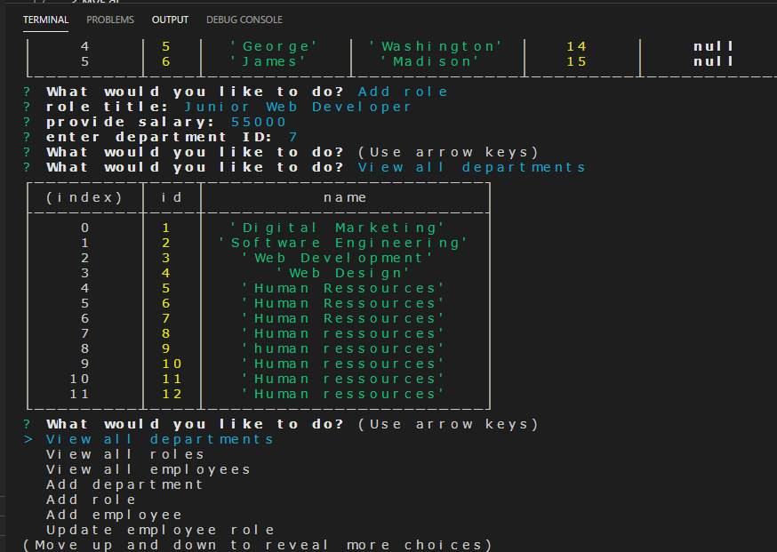

# fatimrobbins.employeetracker.github.io
#**Title** \
Employee Tracker

 \

#**User Story** \
As a business owner
I want to be able to view and manage the departments, roles, and employees in my company
So that I can organize and plan my business

#**Description** \
The employee tracker is an app that allows you to view all employees, roles and department within your company. \
You can add a new employee, department or role, but also update your data as needed.

#**Technologies** used \
1.Node.js \
2.JSON \
3.MySql\ 
4.Javascript 

#**Author**\
Fatim Robbins fmsis@hotmail.com 

